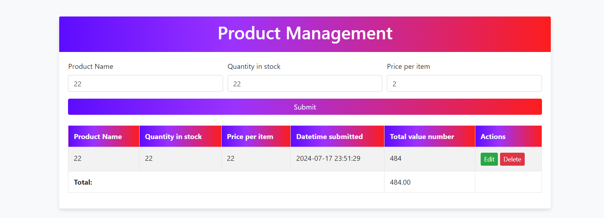

# Laravel Product Management Application

This is a Laravel application for managing products, including functionalities for adding, editing, and deleting products. The data is stored in a JSON file and is displayed on a web page using a beautiful UI with inline editing capabilities.

## Features

- Add new products with details such as Product Name, Quantity in Stock, and Price per Item.
- Edit existing products inline.
- Delete products.
- Display the total value for each product and the sum total of all products.
- Data stored in a JSON file.
- Uses AJAX for submitting and updating data without refreshing the page.
- Styled using Bootstrap with a custom gradient theme.

## Requirements

- PHP 8.1 or higher
- Composer
- Laravel 10
- Node.js and npm (for frontend dependencies)

## Setup Instructions

### 1. Clone the Repository
```bash
git clone https://github.com/DaniyalShafiq205/CT_test_v2.git
```

```bash
  cd my-project
```

Install dependencies

```bash
  composer install
```

Start the server

```bash
  php artisan serve
```

```bash
  php artisan test --coverage
```

```bash
  php artisan test
```


## Portal Views Screenshots




## Authors

- [@mehmoodshafiq]()
